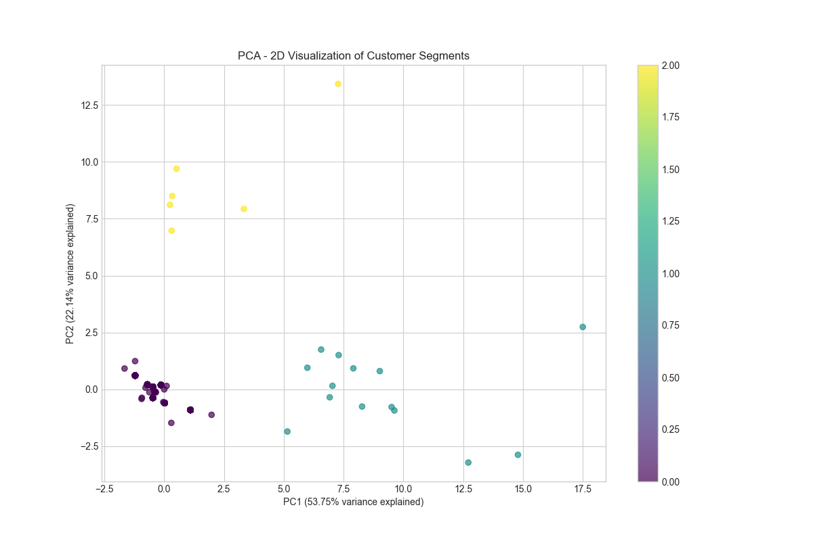
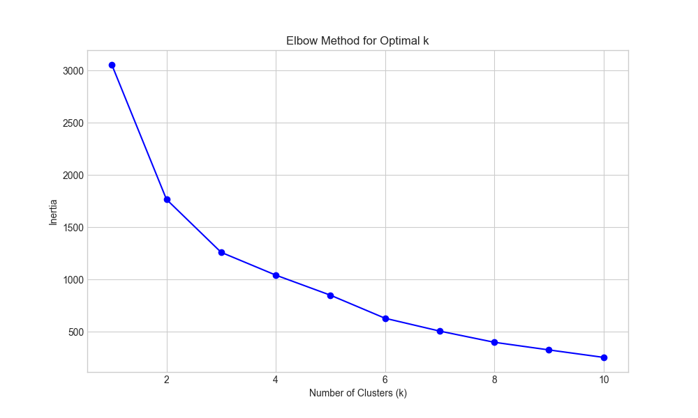
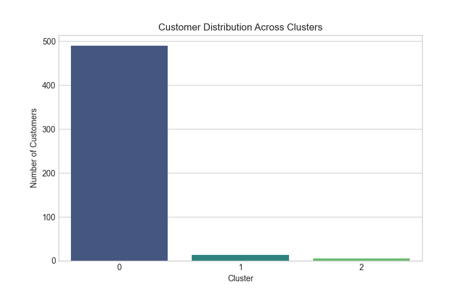
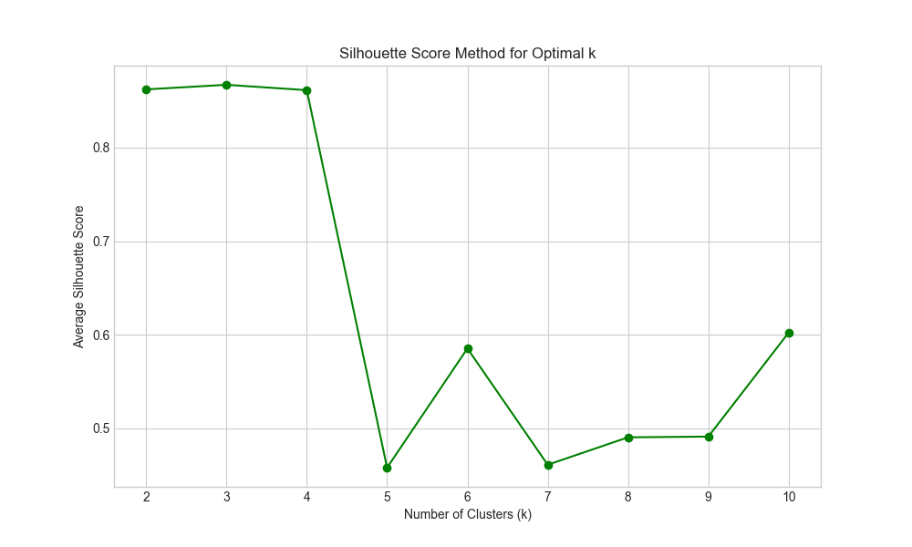
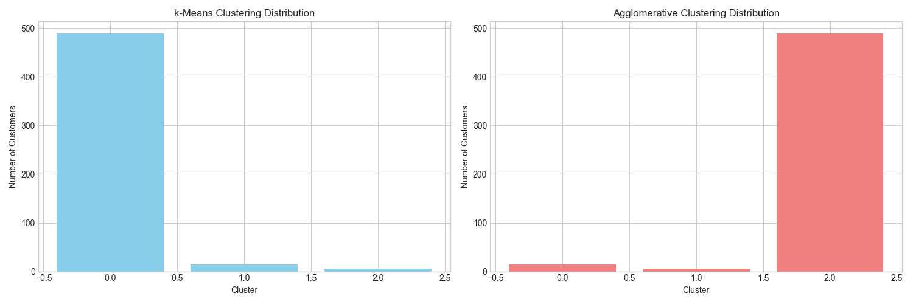
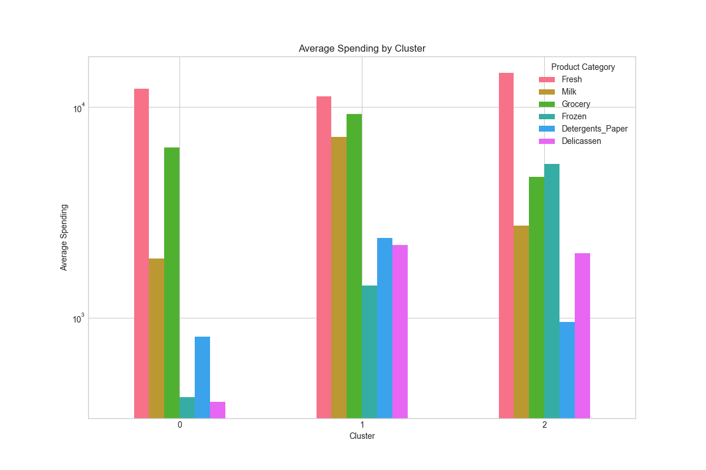
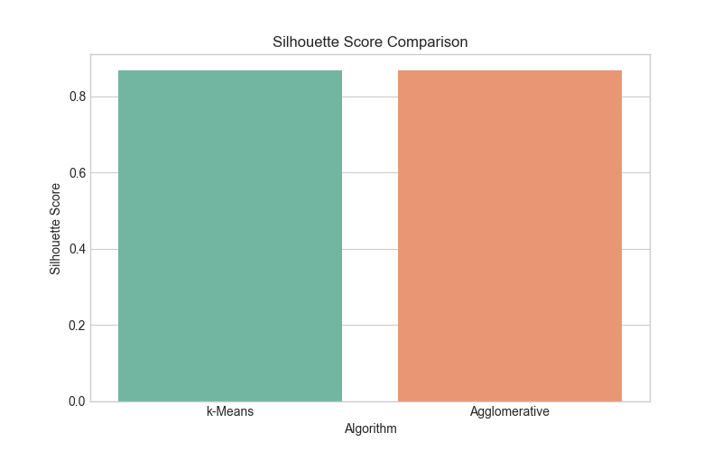

# Wholesale Customer Segmentation Platform

A complete full-stack web application that clusters wholesale customers using spending patterns and visualizes segments with an animated and modern frontend UI.

## 🎯 Objective

Build a complete full-stack web application that clusters wholesale customers using spending patterns and **visualizes segments with an animated and modern frontend UI**.

Use the **UCI Wholesale Customers dataset** and deliver **actionable customer personas** to support marketing strategy.

## 🧠 Project Structure

```
wholesale-segmentation/
├─ notebook/
│  └─ customer_segmentation.ipynb    # ML analysis and clustering
├─ ml/
│  ├─ kmeans.pkl                     # Trained k-Means model
│  ├─ scaler.pkl                     # Feature scaler
│  ├─ pca.pkl                        # PCA transformer
│  ├─ imputer.pkl                    # Missing value imputer
│  ├─ personas.json                  # Customer personas (JSON)
│  ├─ personas.md                    # Customer personas (Markdown)
│  ├─ processed_data.csv             # Processed customer data
│  ├─ pca_data.csv                   # PCA-transformed data
│  ├─ elbow_data.json                # Elbow method data
│  └─ [visualization files]          # Charts and graphs
├─ backend/
│  ├─ main.py                        # FastAPI backend
│  ├─ requirements.txt               # Python dependencies
│  └─ README.md                      # Backend documentation
├─ frontend/
│  └─ customer-segmentation-ui/      # React frontend
│     ├─ src/                        # Source code
│     ├─ package.json                # Dependencies
│     └─ README.md                   # Frontend documentation
└─ README.md                         # This file
```

## 1️⃣ ML Analysis

The ML notebook performs customer segmentation on the UCI Wholesale Customers dataset using:

- **k-Means Clustering** with optimal k selection using Elbow and Silhouette methods
- **Agglomerative Clustering** for comparison
- **Principal Component Analysis (PCA)** for 2D visualization
- **Data preprocessing** with imputation and scaling
- **Business personas** generation with marketing insights

### Key Features

- EDA: distributions, correlation heatmap, outlier check
- Scaling: StandardScaler with missing value imputation
- Choosing optimal **k** using Elbow + Silhouette methods
- Train k-Means model and evaluate using Silhouette Score and Calinski–Harabasz Score
- PCA → reduce to 2 components for 2D visualization
- Label clusters + interpret based on spending categories

### Business Personas

For each cluster, the analysis extracts:
- Highest/lowest spend category
- Mean spend across categories
- Behavioral tag (e.g., "Bulk Buyers for Fresh", "Grocery-Dominant Retailers", etc.)
- Business persona summary with actionable marketing insights

## 2️⃣ Backend API (FastAPI)

The backend provides RESTful endpoints for the frontend:

| Method | Route       | Description                                              |
| ------ | ----------- | -------------------------------------------------------- |
| POST   | `/segment`  | Accept spending values and predict cluster + persona     |
| GET    | `/clusters` | Return cluster persona summaries                         |
| GET    | `/pca`      | Return PCA-transformed 2D scatter data for all customers |
| GET    | `/elbow`    | Return inertia values for elbow chart                    |

## 3️⃣ Frontend UI (React)

A modern, animated frontend with:

### Pages
- **Home** - Hero animation, project description, CTA button
- **Customer Segmentation Form** - Animated input cards + micro-interactions
- **Result Screen** - Cluster result card with animations (react-spring)
- **Personas Explorer** - Flip-card animation for persona cards
- **PCA Visualization** - Dynamic scatter plot with fade-in + hover tooltips

### Animations & Effects
- Entrance fade + stagger on components
- Hover bounce / card scaling
- Page transitions (slide / opacity)
- Skeleton loaders while fetching
- Smooth scroll

### Design
- Modern dashboard style with glassmorphism effects
- Color theme per segment (e.g., cluster 0 = blue, cluster 1 = green…)
- Mobile responsive

## 4️⃣ Visualizations

| Visual                           | Source                |
| -------------------------------- | --------------------- |
| PCA 2D scatter                   | Backend `/pca`        |
| Spending radar chart per cluster | Compute cluster means |
| Elbow curve                      | Backend `/elbow`      |
| Silhouette score bar chart       | Computed in notebook  |

## 🚀 Getting Started

### Prerequisites
- Python 3.7+
- Node.js 14+
- pip package manager

### Installation

1. **ML Analysis**
   ```bash
   cd notebook
   # Run the customer_segmentation.ipynb notebook
   ```

2. **Backend**
   ```bash
   cd backend
   pip install -r requirements.txt
   uvicorn main:app --reload
   ```

3. **Frontend**
   ```bash
   cd frontend/customer-segmentation-ui
   npm install
   npm start
   ```

## 📊 Business Insights

The platform helps marketing teams answer:
- Which group of customers should receive premium pricing offers?
- Which customers need retention-focused discounts?
- Which segments are seasonal?
- What product category is most valuable per segment?

### Sample Personas

1. **Cluster 0: Fresh Produce Specialists**
   - Dominant Category: Fresh
   - Weakest Category: Delicassen
   - Size: 489 customers
   - Persona: High-volume fresh produce buyers
   - Campaign: Promote organic and specialty fresh produce lines with volume discounts

2. **Cluster 1: Grocery-Dominant Retailers**
   - Dominant Category: Grocery
   - Weakest Category: Frozen
   - Size: 14 customers
   - Persona: Focus heavily on grocery items
   - Campaign: Introduce loyalty programs and bundled grocery packages

3. **Cluster 2: Diverse Purchasers**
   - Dominant Category: Fresh
   - Weakest Category: Detergents_Paper
   - Size: 6 customers
   - Persona: Balanced spending across categories
   - Campaign: Offer cross-category promotions and personalized recommendations

## 📈 Key Visualizations

### PCA Visualization

*PCA 2D Visualization of Customer Segments*

### Elbow Curve

*Elbow Method for Optimal k Selection*

### Cluster Distribution

*Customer Distribution Across Clusters*

### Silhouette Scores

*Silhouette Score Analysis for Different k Values*

### Clustering Comparison

*Comparison of k-Means vs Agglomerative Clustering*

### Cluster Spending Patterns

*Average Spending by Category for Each Cluster*

### Algorithm Comparison

*Performance Comparison of Different Clustering Algorithms*

## 🛠️ Technologies Used

- **ML**: Python, scikit-learn, pandas, numpy, matplotlib, seaborn
- **Backend**: FastAPI, Python, pickle
- **Frontend**: React, react-spring, CSS3, HTML5
- **Visualization**: Chart.js (planned), matplotlib, seaborn

## 📁 Project Architecture

See [architecture.md](architecture.md) for detailed information about the system architecture.

## 📄 License

This project is licensed under the MIT License - see the [LICENSE](LICENSE) file for details.

## 🤝 Contributing

Contributions are welcome! Please feel free to submit a Pull Request.