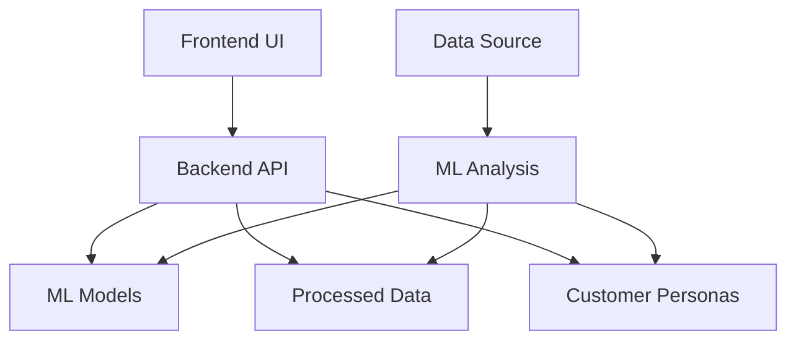
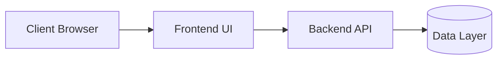

# Architecture Overview

This document provides a high-level overview of the Wholesale Customer Segmentation Platform architecture.

## System Components

The platform consists of four main components:

1. **ML Analysis Module** - Performs customer segmentation using k-Means and Agglomerative Clustering
2. **Backend API** - Serves segmentation results and customer personas via RESTful endpoints
3. **Frontend UI** - Provides an interactive dashboard with visualizations and animations
4. **Data Layer** - Stores processed data, trained models, and generated personas

## Component Diagram

## ML Analysis Module

The ML Analysis module is responsible for:

- Data preprocessing and cleaning
- Feature scaling using StandardScaler
- Handling missing values with imputation
- Determining optimal number of clusters using Elbow Method and Silhouette Score
- Training k-Means and Agglomerative Clustering models
- Dimensionality reduction using PCA
- Generating customer personas based on cluster characteristics

### Key Files
- `notebook/customer_segmentation.ipynb` - Main analysis notebook
- `run_analysis.py` - Script to run the complete analysis
- `ml/*.pkl` - Trained models (kmeans, scaler, imputer, pca)
- `ml/*.png` - Generated visualizations

## Backend API

The Backend API is built with FastAPI and provides the following endpoints:

- `POST /segment` - Accepts customer spending data and returns predicted cluster and persona
- `GET /clusters` - Returns all cluster personas
- `GET /pca` - Returns PCA-transformed data for visualization
- `GET /elbow` - Returns elbow method data for visualization

### Key Files
- `backend/main.py` - Main API application
- `backend/requirements.txt` - Python dependencies

## Frontend UI

The Frontend UI is built with React and provides:

- Animated transitions between pages
- Customer segmentation form
- Persona explorer with flip-card animations
- Interactive visualizations (PCA scatter plot, elbow curve, etc.)
- Responsive design for all device sizes

### Key Files
- `frontend/customer-segmentation-ui/src/App.js` - Main application component
- `frontend/customer-segmentation-ui/src/App.css` - Styling
- `frontend/customer-segmentation-ui/package.json` - Frontend dependencies

## Data Layer

The Data Layer consists of:

- Processed customer data in CSV format
- Trained ML models in pickle format
- Generated customer personas in JSON and Markdown formats
- Visualization images

### Key Files
- `ml/processed_data.csv` - Cleaned and processed customer data
- `ml/*.pkl` - Serialized ML models
- `ml/personas.json` - Customer personas in JSON format
- `ml/personas.md` - Customer personas in Markdown format
- `ml/*.png` - Generated visualization images

## Data Flow

1. Raw customer data is processed and cleaned by the ML Analysis module
2. ML models are trained on the processed data
3. Customer personas are generated based on cluster analysis
4. Trained models and personas are saved to the data layer
5. Backend API loads models and data at startup
6. Frontend UI communicates with Backend API to get segmentation results
7. Visualizations are either generated dynamically or served as static images

## Deployment Architecture

The application can be deployed as three separate services:
- Frontend UI served by a web server (e.g., Nginx)
- Backend API running as a standalone service
- Data Layer stored on a file system or database

## Technology Stack

- **ML/Analysis**: Python, scikit-learn, pandas, numpy, matplotlib, seaborn
- **Backend**: FastAPI, Python
- **Frontend**: React, CSS3, react-spring for animations
- **Data Storage**: File system (CSV, JSON, Pickle files)
- **Visualization**: Matplotlib, Chart.js (planned)

## Security Considerations

- CORS is enabled for all origins in development
- Input validation is performed on all API endpoints
- No authentication is implemented (assumed to be behind a secure gateway in production)

## Scalability Considerations

- ML models are loaded once at startup for efficient prediction
- Backend API is stateless and can be scaled horizontally
- Frontend UI is static and can be served by CDNs
- Data processing is done offline and results are cached